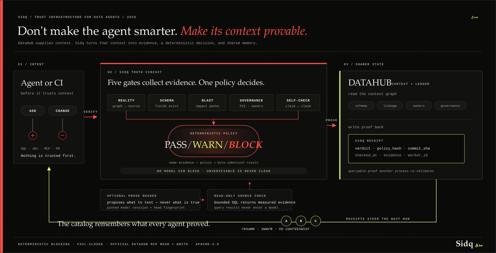

# Sidq

[](https://github.com/NexuChat/sidq/actions/workflows/ci.yml)

> **When DataHub says a column exists but PostgreSQL says it doesn't, Sidq blocks
> the agent — and writes the proof back through DataHub's official MCP tools.**
> It refuses what the evidence cannot support, proposes only the fix its own engine
> re-proves, and leaves a receipt the next agent inherits. Four of them can work one
> catalog at once with no coordinator.

**Submission film:** real footage in five of six chapters — the live catalog
audit, the committed `BLOCK` replay ending on the public sealed PR thread, the
deployed console, the receipt inside the DataHub UI with its independent
`sidq verify` read, and the same agent run blind and guarded;
production contract and artifact identity in [`docs/VIDEO.md`](docs/VIDEO.md).
Watch it at
[youtube.com/watch?v=R4GdN36Lsno](https://www.youtube.com/watch?v=R4GdN36Lsno).
Public browser,
accessibility, interaction, and deployment evidence: [`docs/QA-RESULTS.md`](docs/QA-RESULTS.md).
Contributions are welcome under [`CONTRIBUTING.md`](CONTRIBUTING.md) and the
[`CODE_OF_CONDUCT.md`](CODE_OF_CONDUCT.md).



Sidq is a DataHub-native verification layer for agents and data-code changes. It checks whether catalog context is truthful before an agent relies on it — against the catalog's own claims *and* against the live source — then applies an explicit policy and leaves evidence in DataHub that the next agent inherits.

## Proof, one row per judging criterion

Every row is one command or one committed artifact. Nothing here is a screenshot of itself.

| Criterion | The claim | Check it |
|---|---|---|
| **Use of DataHub** | Read → decide → **write** through the official MCP server, then a *separate process* reads the receipt back and recomputes its own verdict. Verdicts also land in DataHub's own **Quality tab** as native assertions (platform `sidq`). And the catalog is not only the output — it is the **only shared state four concurrent workers have**: no coordinator, no IPC, a peer killed mid-run, 14 distinct assets in 18 examinations, measured. | `make live-loop` · `make swarm-demo` · [`examples/06-native-assertion/`](examples/06-native-assertion/) |
| **Technical execution** | 1,170 tests, lint, format and types in one gate; the flagship `BLOCK` re-derives **byte-identical** from committed evidence. Published numbers are guarded — a stale one fails the build. | `make check` · `make gate-demo` |
| **Originality** | The question is not "what is in the catalog" but "is the catalog telling the truth" — proved on DataHub's **own shipped sample**: examining all **67 datasets** found 285 internal contradictions, concentrated in **5 assets**. And against reality: the live source renames a column, the catalog does not, Sidq blocks the context. | [`docs/TRUTH-REPORT.md`](docs/TRUTH-REPORT.md) · `make demo-break` |
| **Real-world usefulness** | A PII removal is blocked with its lineage path to a Looker dashboard. The repair agent **refuses its own obvious fix** because the engine re-proved it moves the leak instead of closing it. | [`examples/01-blocked-pii-dashboard/`](examples/01-blocked-pii-dashboard/) · `make repair-demo` |
| **Submission quality** | A 2:56 film with real footage, a live console whose buttons run the real commands, and a read-only judge account on a live DataHub. | [the film](https://www.youtube.com/watch?v=R4GdN36Lsno) · [sidq.mlki.app](https://sidq.mlki.app) · [`docs/QA-RESULTS.md`](docs/QA-RESULTS.md) |
| **Bonus: OSS contribution** | A packaging fix to DataHub core and a proposed `datahub-verify` skill — both open, neither merged, described as contributions in review rather than endorsements. | [datahub#19017](https://github.com/datahub-project/datahub/pull/19017) · [datahub-skills#81](https://github.com/datahub-project/datahub-skills/pull/81) |

## Why the name

**صِدق** — *sidq* — is the Arabic word for truthfulness. Not honesty as a
sentiment: the discipline of saying only what you can stand behind.

The tool is named after the rule it enforces. A check that could not complete
is never reported as clean. A receipt never claims more than the evidence
inside it. A reader that cannot re-verify a receipt says `NOT VERIFIED` and
fails closed. An agent that cannot confirm the catalog refuses to build on it.
Every one of those behaviors is the same single idea, and Arabic has one word
for it.

That is also why the name is the correct kind of untranslatable: a judge who
asks what "Sidq" means gets the entire design philosophy in the answer.

## Install and connect

Choose the boundary you actually need.

**Offline — no DataHub or credentials.** The flagship verdict replay
self-bootstraps its hash-locked Python environment on first use:

```bash
git clone https://github.com/NexuChat/sidq.git
cd sidq
make gate-demo
```

Run `make install` first instead when you want the environment installed without
running the demo. Both paths require Python 3.12 and package-index access on the
first run; the replay itself uses only committed evidence.

**Connected — live DataHub.** Install Python 3.12, Docker with Compose, and
[`uv`](https://docs.astral.sh/uv/getting-started/installation/), then follow the
fresh-clone sequence in [`docs/SETUP.md`](docs/SETUP.md):

```bash
cd /absolute/path/to/sidq
make mcp-install
# Start DataHub OSS as shown in docs/SETUP.md, then:
make demo-stack
make mcp-smoke
make live-loop
```

`make mcp-smoke` initializes `sidq-mcp` and requires its exact three-tool list,
then exercises the official `mcp-server-datahub` against the live DataHub graph.
`make demo-stack` connects the repository demo to an already-running external
DataHub OSS quickstart. The repository's Compose file supplies only the controlled
PostgreSQL source; it relies on an already-running DataHub and its
`datahub_network`. These are connected components, not a single Compose graph.

To attach Sidq's own server to Codex, use an absolute executable path and the
absolute root of the data repository Sidq should inspect:

```bash
codex mcp add sidq --env DATAHUB_GMS_URL=http://localhost:8080 --env SIDQ_REPO_ROOT=/absolute/path/to/data-repository -- /absolute/path/to/sidq/.venv/bin/sidq-mcp
codex mcp list
```

Start Codex and enter `/mcp` to confirm that `sidq` and its three tools are
active. Secret tokens and DSNs belong in the parent environment and are
forwarded by name in `.codex/config.toml`; do not put their values in the file.
The exact configuration is in [`docs/MCP-SERVER.md`](docs/MCP-SERVER.md).

The official `mcp-server-datahub` is Sidq's graph dependency. `sidq-mcp` is the
separate Sidq server that exposes exactly three tools: `check_change`,
`verify_context`, and `search_verified`.

`search_verified` classifies catalog matches with records in the Sidq MCP
verification store; it is not a DataHub receipt reader. The independent Receipt
consumer is `sidq verify <urn>`, which reads the Receipt and current context from
DataHub in a separate process.

## Judge runbook

Five commands, in order of how much runtime infrastructure they need. Rows 1 and
2 bootstrap a Python 3.12 environment from the committed hash-locked dependency
file on first use, so that first run needs package-index access.

| # | Command | Needs | What it proves | Takes |
|---|---|---|---|---|
| 1 | `make gate-demo` | Python 3.12; package downloads on first use; no DataHub or credentials | The published `BLOCK` verdict is re-derived from the committed graph recording, byte-identical, with the same `policy_hash`. Hand-editing an artifact fails this. | ~2s after bootstrap |
| 2 | `make check` | Python 3.12; package downloads on first use | 1170 tests, lint, format, types — 1169 passed, 1 optional integration skipped, with 84.04% branch coverage; the same gates CI runs. Runs across all cores. | ~45s after bootstrap |
| 3 | `make live-loop` | a running DataHub ([`docs/SETUP.md`](docs/SETUP.md)) | The whole agent loop over the **official MCP server only**: read → decide → write a receipt → a *separate process* reads it back → an asset carrying no receipt returns `NOT VERIFIED`. | ~60s |
| 4 | `make repair-demo` | the same DataHub | The repair agent proposes a fix from catalog evidence, re-runs the deterministic engine against the catalog that fix *would* create, and shows what it proved and what it refused. | ~40s |
| 5 | `make swarm-demo` | the same DataHub | **Four agents on one catalog with no coordinator and no IPC.** They divide the work purely through the receipts they write, one is killed mid-run and its unfinished assets are never lost, and a fifth process that audited nothing reads the ledger back out of DataHub. | ~90s |

Nothing above is pre-rendered output. If you have no DataHub, run 1 and 2: after
the locked bootstrap they replay committed evidence locally without connecting
to a catalog or source. Update the lock intentionally with `make lock`; ordinary
judge bootstrap consumes it and never derives dependencies from an ambient
environment.

You can also run row 1, a live catalog audit, and row 4's dry run from the
hosted page without cloning anything: [sidq.mlki.app](https://sidq.mlki.app) has
**Run it here** buttons that execute the real commands on the host and print the
real output. The runnable set is a closed table with no request input, and a
test asserts it contains nothing that can write to a catalog.

**What to look at if you only have five minutes.** Run `make gate-demo`, then open
[`examples/01-blocked-pii-dashboard/verdict.json`](examples/01-blocked-pii-dashboard/verdict.json)
and confirm the printed hash matches the committed one. That single check
establishes the property everything else rests on: the decision is reproducible
and no model participated in it.


## The questions a platform team will ask

**Data privacy.** Catalog audits read metadata only — schemas, lineage, tags,
owners — and receipt writes are explicit opt-ins into *your* catalog. The
separate `sidq claims` attestation is also opt-in: it runs bounded read-only SQL
inside the live source, returns counts plus at most ten violating samples, and
never sends them outside your infrastructure. Query results never enter a model;
the optional reader sees documentation text only. Self-hosted, Apache-2.0.

**Reliability of results.** The policy verdict is deterministic for the same
captured evidence and policy; `policy_hash` and `commit_sha` are provenance
fields, not sufficient replay inputs. CI guards the engine and pins the
headline published counts to committed artifacts; links beside the remaining
measurements identify their evidence and scope. Re-derive the flagship answer
with `make gate-demo` and compare hashes.

Receipt staleness covers the current semantic entity metadata plus complete
one-hop upstream and downstream lineage. Sidq's own receipt properties, badges,
and evidence documents are excluded so a successful write does not invalidate
itself. Missing, partial, or error context is stale (fail-closed), and a
policy-hash mismatch invalidates immediately. The CLI default maximum age is 7
days. The hosted public handoff alone uses 45 days solely to span judging through
August 31, 2026; any context or policy change still invalidates immediately.

**Model drift.** No model can block or grant permission. The deterministic gate
beat the classifier on cost at equal held-out fixture-regression consistency; for one change, the classifier is
three orders of magnitude slower, so the rule ships in the blocking path
(`docs/DECISION-COST.md`, `docs/PREFLIGHT-RESULTS.md`). The optional
documentation reader exists on the other side of that boundary: it may extend
`WARN` coverage only after rules abstain, and every proposal still has to survive
read-only SQL. It loads a pinned revision and reports its head fingerprint and
threshold, so warning coverage cannot drift invisibly. *Policy* drift is explicit:
changing `policy_hash` invalidates receipts written under the old policy.

**Monitoring.** The receipts are the monitoring surface: `sidq.*` properties are
queryable through DataHub search, and `sidq verify <urn>` is a health check any
pipeline can call. The current-state observer proves only current recognizable
non-stale receipts, the subset carrying this swarm's run id as current-run
receipts, and each latest receipt's latest worker attribution. DataHub stores the
latest structured-property values, not append-only examination history.

**Cost.** Apache-2.0, self-hosted, zero API fees. The gate, audit, repair, and
swarm paths do not call a model; the optional documentation reader runs locally.
The deterministic decision took 51 ns in the recorded single-machine benchmark,
so ordinary run cost is dominated by MCP reads. Column lineage spends one MCP
call per column and is explicitly budgeted; its wall time is environment- and
catalog-dependent. Resumed audits do not repay work while a current Receipt
still holds.

## The problem is already in the sample

We scanned DataHub's own shipped `showcase-ecommerce` sample using read-only catalog metadata. All **67 datasets** were examined, surfacing **285 internal contradictions**, concentrated in **5 assets** — plus **29 consumed-but-unowned assets** spread across the sample. The concentration is the point, not a caveat: a handful of PowerBI measure assets carry hundreds of lineage edges into fields their own stored schemas do not have, and nothing flags it. This is not a claim that DataHub's source systems are broken. It is a narrower, hand-checkable finding: the catalog contains claims that contradict other claims visible in the catalog. A curated, officially shipped sample already contains this much inconsistency; nothing in the sample checks for it before an agent builds on it.

One example is `powerbi … Customer_Analytics_Measures`. Its stored schema has exactly two fields: `Value` and `Customer LTV`. The catalog nevertheless records **57 column-lineage edges into fields that schema does not contain**. Each of the 57 is an individual finding you can read: the complete evidence is in [`docs/TRUTH-REPORT.md`](docs/TRUTH-REPORT.md) and [`examples/03-catalog-truth-report/report.json`](examples/03-catalog-truth-report/report.json).

The negative result matters too. `lineage_rot` could not be adjudicated on this sample because the datapack ships no model SQL. All **32/32** attempts were `unverifiable`; Sidq refused to call them rot without a code-versus-catalog comparison. A tool that knows when to stay silent is the product.

### What each check compares — and what it refuses to guess

Every check names the comparison it performed, and every boundary below is
enforced in code and pinned by a test.

**Field identity is resolved, not string-matched.** A column crossing platforms
carries the spelling each one imposes: Snowflake upper-cases, dbt lower-cases,
and JSON and Avro schemas arrive as `[version=2.0].[type=struct]…` paths. Sidq
resolves those to one identity — exact, case-folded, and nested-leaf — so a
naming convention is never reported as a contradiction. It stops there by
design: anything beyond those three forms is a genuine mismatch and is reported.

**Protection is recognised by meaning, not by label.** A column inherited from a
`PII` source is routinely marked `GDPR`, `HIPAA`, `Confidential`, or
`Sensitive`. Any of those satisfies the check. A bare denial such as `not_pii`
does not — a column claiming the opposite of its upstream is exactly the
contradiction worth surfacing.

**Deprecation is read both ways DataHub records it**: the first-class
`Deprecation` aspect the UI writes, and the custom-property form some ingestion
sources emit. Either one counts.

**A bounded view says so.** MCP `search` returns one page of a catalog, and an
edge leaving that page points at an asset that exists outside the window. Sidq
adjudicates dangling edges only against a complete view, and reports the rest as
`unverifiable` — a paged reader's boundary is not the catalog's contradiction.

**Documented claims are tested against the live source.** `sidq claims` reads a
dataset's field descriptions from DataHub through the official MCP server, turns
each documented sentence into a testable claim, compiles that claim to read-only
SQL, runs it against the live PostgreSQL source, and lets the deterministic policy
engine judge the row counts that come back. The boundary has two sides: a model
may decide what to test; only the engine may decide what is true. The deterministic
reader runs first and the model is consulted only on sentences it declined; a
model-proposed claim that could not be tested contributes nothing and is dropped,
so it can never cause a `BLOCK`.

The reader is a linear head over `microsoft/harrier-oss-v1-270m`, a multilingual
embedding model covering 94+ languages. Trained on 2,048 rows and evaluated on a
held-out 528, it reaches 95.8% precision and 58.0% recall at its operating point
on 72 proposals. It proposes only `unique` and `not_null`, the two claim types
that need no arguments. A gradient-boosted head had the same precision within
noise and 16 points worse recall, while adding a training stack to inference.
On the documented `make claims-demo` path, 6 documented fields produce 3
rule-derived claims; we do not call a reader result that the environment cannot
produce. The fourth claim requires the optional `reader` extra (`.[reader]`, which
installs `sentence-transformers`); with it, the trained reader proposes that fourth
claim. The three rule-derived claims still find one violation: `status` is documented
as "One of: pending, paid, fulfilled" while 12 rows are `refunded`; the verdict is
`WARN`. Details are in [`docs/CLAIM-READER.md`](docs/CLAIM-READER.md).

Neither reader is required and neither is on by default. `--reader` is the trained head
above. `--model` is a separate, third path: a local Ollama runtime, `ibm/granite4:1b-q4_1`
by default, consulted only on sentences the deterministic reader declined. Sidq trained
no part of that one and does not ship it. With Ollama absent, or the `reader` extra
uninstalled, `sidq claims` reports what the rules found and says which reader it could
not use — it does not quietly return a thinner answer as if it were the whole one.

**Ownership is read as recorded.** `unowned_consumed` counts assets with no
direct ownership record; inherited ownership is a governance convention Sidq
does not infer.

The rule underneath all of them is the same one the product is built on: an
unperformed comparison is never reported as a clean one.

## What Sidq does

Sidq separates evidence collection from judgment:

1. **Truth checks** compare catalog claims with reality or with each other:
   - `schema_drift`: catalog schema versus a live PostgreSQL source.
   - `lineage_rot`: stored column lineage versus local model SQL. Missing SQL is `unverifiable`, not clean and not rot.
   - `doc_rot`: descriptions that refer to columns no longer present.
   - `constraint_reconciliation`: catalog constraint claims versus what the source enforces. The database is the authority on what it enforces; the catalog is a claim about it, and disagreement is the finding. Measured coverage and the honest abstention rate are published in [`docs/RECONCILE-COVERAGE.md`](docs/RECONCILE-COVERAGE.md).
   - catalog self-contradictions such as a lineage target field missing from its stored target schema.
2. **Change gates** resolve changed SQL/dbt files to DataHub assets, check referenced datasets and fields, calculate downstream blast radius and paths, and apply governance evidence such as PII, ownership, and deprecation where available.
3. **Documentation claims** read field descriptions through the official DataHub MCP server, compile them to read-only SQL, run them against the live PostgreSQL source, and pass the returned row counts to the policy engine.
4. **The policy engine** turns evidence into exactly `PASS`, `WARN`, or `BLOCK`. A graph failure is fail-closed: it becomes evidence and cannot grant permission.

The boundary is explicit. The deterministic findings are the only findings that can produce `BLOCK`. An advisory finding can produce `WARN` only and can never turn `PASS` into `BLOCK`:

```json
{
  "decision": "WARN",
  "deterministic_findings": ["only these can block"],
  "advisory_findings": ["never blocks"]
}
```

The blocking path contains no model calls. The optional documentation reader is
the measured advisory lane: it can propose a read-only query and can extend
`WARN` coverage, but it can never grant permission or produce `BLOCK`. The same
captured evidence and policy produce a byte-identical decision; the hashes
identify recorded provenance but do not alone reproduce a live decision.

## Try it in one command

From a fresh clone, start with the offline proof. It downloads the locked Python
packages on first use, then re-derives the published decision with no DataHub:

```bash
make gate-demo
```

The printed hashes must match the clickable committed proof:
[`verdict.json`](examples/01-blocked-pii-dashboard/verdict.json) and its rendered
[`PR comment`](examples/01-blocked-pii-dashboard/pr-comment.md).

With a live DataHub connected, the catalog audit is:

Point Sidq at a catalog it has never seen. It ranks every asset by how much damage
a lie about it would do — downstream consumers, PII tags, missing ownership,
deprecation — examines the worst first, and tells you what it found *and what it
did not get to*.

```bash
.venv/bin/sidq audit --server http://localhost:8080 --budget 40
```

Run against a DataHub carrying the shipped `showcase-ecommerce` sample, it
perceives 93 entities and 964 lineage edges, chooses its own order, and finds
**all 285 `lineage_field_missing` contradictions inside its first 40 assets** —
because it starts with the one carrying 500 downstream consumers rather than with
whatever the catalog happens to list first.

It also reports unowned consumed assets, and that count is worth reading
carefully: the audit published in
[`examples/03-catalog-truth-report/report.json`](examples/03-catalog-truth-report/report.json)
found 29 across the 82 `showcase-ecommerce` entities it was scoped to, while a
live run here reports 31 because this DataHub also carries the bundled demo
project. Same check, different catalog contents. The published figure is the one
scoped to the sample.

`--write-receipts` attempts a queryable `sidq.*` receipt for each examined asset.
Accepted writes can be read by the next agent; rejected writes are reported and
do not become evidence. Writeback is off by default: an audit does not mutate a
catalog unless you ask it to.

Adding `--write-assertions` mirrors each accepted receipt into DataHub's own
Validation surface as a native assertion, so the verdict is visible where a data
team already looks. It requires `--write-receipts`, it reports a verdict Sidq
already decided rather than producing one, and a receipt whose write failed is
never mirrored.

It runs from the same environment as everything else, with zero extra
dependencies. The official MCP server has no assertion write tool, so this one
writeback surface uses DataHub's documented, authorization-checked GraphQL
custom-assertion API (`upsertCustomAssertion` / `reportAssertionResult`) over
plain HTTP — the front door DataHub built for exactly this capability, not a
raw side channel. Retries are safe by measurement: DataHub derives the run id
from the caller's timestamp and deduplicates reports at the same instant, and a
rule that stops firing is retired once while an assertion the operator
soft-deleted is never resurrected. The live proof — emitted from the runbook
venv, re-read through the same GraphQL query DataHub's own UI issues, re-run to
show it updates rather than duplicates, and photographed rendering in DataHub's
Quality tab with `sidq` as the assertion's platform — is committed in
[`examples/06-native-assertion/`](examples/06-native-assertion/).

### Run against catalogs it was never built for

Every number above comes from the `showcase-ecommerce` sample, so the fair
question is what happens on a catalog Sidq has never seen. Two of DataHub's
other shipped sources were loaded on top of it — the `bootstrap` datapack and
the `demo-data` ingestion source — producing a merged catalog of **103 entities
and 976 lineage edges across 11 platforms** (postgres, snowflake, dbt, s3,
tableau, powerbi, hive, looker, hdfs, kafka, and untyped entities).

The engine absorbed it in four seconds, and the result is the part worth
reporting: the contradiction count did not move. Still 285 `lineage_field_missing`
and the same concentration — because the added platforms genuinely contain no
field-level contradictions, and an engine that invented some would be worse than
one that found none. The governance count did move, from 29 to 37 unowned
consumed assets, which is what an honest check should do when real unowned
assets are added.

Beyond DataHub's own packs, the engine is held to catalogs generated for
domains and languages it never grew up in — hospitals in Arabic, banks in
Chinese, a factory in German, a public registry in Cyrillic, Japanese retail,
nested `[version=2.0].[type=struct]` field paths, and the casing conventions
Snowflake, dbt, and Looker each impose. Every generated catalog states what was
planted in it, so the tests assert both halves: each planted contradiction is
found, and nothing unplanted is invented. The second half is the one that
catches drift toward noise — an engine that reports something on every catalog
is not verifying, it is guessing confidently.

Researching how real catalogs actually name things went further, and turned up
the false positive that mattered most. DataHub links a dbt model and its
Snowflake table as *siblings* — one table, two representations — but Snowflake
stores identifiers upper-cased and dbt lower-cases them. A lineage edge crossing
that boundary read as `CUSTOMER_ID` missing from a schema containing
`customer_id`: a contradiction reported where a human sees a convention, which
is the worst thing a verification tool can do. Field comparison now resolves the
spellings a catalog legitimately uses for one column — exact, case-folded, and
the leaf of a nested `[version=2.0].[type=struct]…` path — and nothing further,
because loosening beyond that would start excusing real contradictions. The
published 285 are unchanged by it, which is the check that mattered: the
`BILLING_ADDRESS_LINE1` claim is absent in every spelling.

Beyond the hand-written catalogs, Hypothesis generates them: assets, fields, and
edges drawn at random across eight platforms and five scripts, with edges that
may name fields nothing has and URNs the catalog does not contain. It asserts
invariants rather than answers — the budget accounts for every asset, `clean`
and `unestablished` never overlap, only examined assets carry receipts, no
finding names an invented asset, and the same catalog always produces the same
run. Roughly half the generated catalogs produce real findings, so the
properties are not vacuous; none has broken an invariant.

That corpus immediately earned its place. Doc-rot detection matched column
references with `[a-z][a-z0-9]*_[a-z0-9_]+`, which cannot see an Arabic,
Japanese, or Cyrillic column name at all: on every non-English catalog the check
ran, found nothing, and the silence read as health. It is Unicode-aware now.

Alongside that, 24 adversarial fixtures hold the engine to the only property
that matters on a strange catalog — cycles, self-loops, 200-hop chains, 500-way
fan-out, Arabic and Chinese and emoji names, edges into assets that do not
exist, `None` where a type says `str`, and eight malformed receipt payloads,
none of which vouch for anything. It terminates, it does not raise, and it never
converts an asset nobody could examine into a clean one.

### The audit that resumes from shared current state

An explicit optional `--write-receipts` run records the latest Sidq receipt values
in DataHub. They are shared current state, not append-only history. `--resume`
reads them back
before planning: an asset a current receipt already covers — same policy hash,
not aged out, and the same semantic entity plus complete one-hop lineage
context — is skipped, and the whole budget
flows to assets no run has reached. A recorded refusal counts as covered, because
"we checked and refused" is knowledge rather than a gap; it is reported as
`BLOCKED`, never folded into `vouched`, and it authorizes nothing. Coverage converges run over run under a
budget that never changed. A Sidq instance with access to the same catalog can
re-check those latest values before choosing work. No separate state store is
required for this optimization; the receipt values do not constitute an audit ledger.

```bash
make converge-demo    # both runs, over official MCP, against the live catalog
```

Or by hand — the second command spends the same budget the first did, on what
the first could not reach:

```bash
.venv/bin/sidq audit --server http://localhost:8080 --budget 40 --write-receipts
.venv/bin/sidq audit --server http://localhost:8080 --budget 40 --write-receipts --resume
```

Nothing is skipped on trust. The reader recomputes the receipt's validity itself,
with the same judgment every receipt consumer uses; a receipt that is stale,
absent, or unreadable covers nothing and the asset goes back in the queue — if
the receipts are unreadable, the prior is empty and everything is re-examined.
Forgetting costs budget, never correctness. And the report says `vouched`, never
`verified`, for anything it skipped, and `BLOCKED` rather than `vouched` for a
standing refusal: whose word you are taking, and what that word was, are both
part of the answer.

### The whole loop, on the official MCP server, in one command

`--server` above reads through the DataHub Python SDK. `--via-mcp` reads through
`mcp-server-datahub` instead — the same server any DataHub agent would use, and
nothing else:

```bash
make live-loop        # needs a running DataHub; see docs/SETUP.md
```

Four steps, one process boundary in the middle of them:

1. **Read** through official MCP only — `search`, `get_entities`,
   `list_schema_fields`, `get_lineage`.
2. **Decide** with the shipped policy, and **write** the receipts back through the
   official MCP mutation tools.
3. **Read it back from a separate process**, which independently recomputes
   whether the recorded Receipt still holds under the current context, policy,
   and age. A writer that reports its own success proves nothing.
4. **Ask about an asset carrying no receipt** — chosen at run time, because the
   resuming audit eventually reaches any asset a script could name in advance —
   and get `NOT VERIFIED`, not silence. "We did not check" and "we checked and
   it passed" are the two answers this project exists to keep apart. When every
   dataset carries a receipt, the step reports convergence instead: nothing is
   left to be silent about.

Step 4 is enforced in the code, not just in the demo. MCP returns column lineage
only when asked for one named column, so field lineage costs one call per column
and the run can only afford a subset. Every asset outside that budget is recorded
as unresolved, reported as `NOT established` rather than `verified clean`, and
**gets no receipt at all** — because the policy treats unverifiable evidence as
informational, so an unexamined asset would otherwise have been stamped `PASS`.

### Many auditors, one catalog, no coordinator

`--resume` makes cooperation work across *time*: a later run reads what an
earlier one wrote. The same mechanism works across *space* — several auditor
processes on the same catalog at the same moment, with no message bus, no lock
service, no leader, and no shared filesystem. The only thing they share is
DataHub.

```bash
make swarm-demo    # four workers, one killed mid-run, then the current-state observer
```

Each worker re-reads a receipt immediately before examining its asset and writes
one immediately after deciding. That read-before-write sequence narrows the race
window but cannot remove it. Each worker enters the same consequence-ranked plan
at a worker-specific offset, so four processes do not start on the same asset —
no negotiation, just different starting points, with the receipts steering the
rest.

The promise is **at-least-once, never exactly-once**: MCP offers no claim or
compare-and-set primitive, so two workers reaching the same unreceipted asset
in the same instant can both examine it. Deterministic duplicate work is safe:
both reach the same verdict. The latest receipt overwrites earlier structured
property values, so the observer cannot count collisions after the fact.

The demo kills a worker on purpose. Nothing is assigned, so its unreceipted work
remains eligible for any survivor; this is operational behavior, not a measured
recovery total. A fifth process that audited nothing reads DataHub alone. From
the latest structured-property values it can prove current recognizable
non-stale receipts, current-run receipts, and latest worker attribution only.

DataHub is not merely an input or output to this loop; it is the shared state.

### The repair agent — it proves its fixes before it writes them

Finding a contradiction is half the job. `sidq repair` proposes what to do about
each one, and — more usefully — reports what it cannot fix.

```bash
make repair-demo      # dry run; `sidq repair --via-mcp --apply` may write a jointly proven plan
```

Proposals come from catalog evidence only. In the complete-lineage regression,
two of the six checks are mechanically repairable because the correct value
already exists elsewhere in the fixture: a PII marker that lineage says should
have propagated, and an owner that every owned upstream agrees on. The other four
produce nothing, each with its reason recorded. An agent with an answer for all
six would be inventing four of them.

**Nothing is offered for writing until the deterministic engine has re-run against
the catalog the repair would create.** It must resolve the finding, introduce no
new one, and the surviving set must still hold when applied together.

That gate changed the design rather than decorating it. The committed regression
(`test_a_one_hop_repair_is_refused_because_it_moves_the_leak`, a tagged source
feeding an untagged middle feeding an untagged sink) first tries a PII repair
that tags only the column the finding named. The engine refuses it:

```
Refused — proposed, then disproved:
  warehouse.middle#email
    resolves the finding but introduces 1 new one(s)
    would introduce: pii_leak_untagged on urn:li:dataset:(urn:li:dataPlatform:dbt,warehouse.sink,PROD)#email
```

Read the first line of that refusal carefully: the one-hop repair *does* resolve
the finding it was proposed for. It is refused for what it creates. A one-hop
repair does not fix a leak, it moves it. The proposal the engine accepts instead
covers the field-lineage closure — every column the marker reaches downstream
that does not already declare it, here `warehouse.middle#email` and
`warehouse.sink#email` — as a single MCP call:

```
Proven — the engine re-ran and confirmed each one:
  warehouse.middle#email
    add_tags(urn:li:tag:demo.PII_Data)
    because email upstream carries urn:li:tag:demo.PII_Data, and the catalog's own field lineage carries it into 2 column(s) that do not declare it
    covers 2 columns in one call:
      warehouse.middle#email
      warehouse.sink#email
```

The closure is defined by reachability, not by which columns a check would
flag; it is wide on purpose, because a marker that stops halfway is the leak
again. The live catalog is adjudicated separately: when lineage evidence is
incomplete, the public dry run fails closed, rejects the proposal, and writes
nothing. Its counts are a catalog-dependent snapshot, not inherited proof from
the regression fixture.

## Four surfaces

### 1. The catalog auditor — an agent, not a script

`src/sidq/agent/` decides what to examine from what it has already observed. The
audit script in `examples/03-catalog-truth-report/` reads everything in
enumeration order and behaves identically whatever it finds; the auditor behaves
differently on a different catalog, spends a bounded budget where it matters, and
reports its own coverage gaps rather than presenting a partial sweep as complete.

It never decides truth. It runs the same deterministic engine every other surface
runs and chooses where to point it, so the LLM-free guarantee stays structural
rather than becoming a promise. `examples/05-agent-that-stops/` shows the other
side of the same idea: an analytics agent that asks `verify_context` before it
writes SQL, and stops when the answer is that the catalog cannot be trusted.

### 2. MCP server

`sidq-mcp` exposes exactly three tools over stdio:

| Tool | Question it answers |
|---|---|
| `verify_context(urn)` | Is the catalog telling the truth about this asset right now? |
| `check_change(diff)` | May an agent propose this data-code change? |
| `search_verified(query)` | Which matching assets have fresh, truthful records in this Sidq MCP verification store? |

`search_verified` distinguishes `verified`, `unverified`, `stale`, `unverifiable`, and `rejected`; a failed graph lookup is `GRAPH_UNAVAILABLE`, not an empty search result. Its response names `verification_source: sidq_mcp_store` so it cannot be confused with DataHub Receipt state. Canonical JSON makes an identical complete response byte-identical; runtime fields such as `checked_at` must also be fixed. See [`docs/MCP-SERVER.md`](docs/MCP-SERVER.md) for the client configuration and wire examples.

The repository also ships an installable Agent Skill that makes this verification
sequence the agent's operating rule. Run the installer from the root of the
target data repository where Codex will start, not from the Sidq repository:

```bash
cd /absolute/path/to/data-repository
npx skills add NexuChat/sidq --skill datahub-verify --agent codex
```

That installs the workflow under
`/absolute/path/to/data-repository/.agents/skills/datahub-verify`; it does not
install Sidq or attach an MCP server. Complete the MCP setup above and run
`cd /absolute/path/to/sidq` followed by `make mcp-smoke` before relying on the
skill.

The same skill is proposed to DataHub's official skills repository in
[datahub-project/datahub-skills#81](https://github.com/datahub-project/datahub-skills/pull/81).
The pull request is public review evidence, not a claim that DataHub has merged or
endorsed it.

Setting up the connected path also turned up a packaging bug in DataHub itself,
proposed upstream as
[datahub-project/datahub#19017](https://github.com/datahub-project/datahub/pull/19017):
`datahub.cli.datapack.resources` is missing from `package_data`, so
`datahub/cli/datapack/resources/DATAPACK_AGENT_CONTEXT.md` and `datahub/cli/datapack/resources/registry.json` never reach the built wheel.
`datahub datapack --help` therefore raises `FileNotFoundError` whenever stdout is
not a TTY, and the bundled registry fallback cannot fire. That one is also open
and also unmerged; `docs/SETUP.md` still documents the workaround.

### 3. CLI

The CLI is the canonical engine surface. It accepts a diff or SQL file and emits human-readable or canonical JSON output:

```bash
.venv/bin/sidq check --file demo/dbt/models/customer_revenue.sql --json
.venv/bin/sidq check --diff BASE..HEAD --json
.venv/bin/sidq explain catalog_reality_mismatch
```

Exit codes are `0` for `PASS`, `1` for `WARN`, and `2` for `BLOCK`. The JSON verdict is the artifact consumed by the MCP server, PR bot, and receipt path.

### 4. GitHub PR bot

The bot renders deterministic findings, provenance, graph evidence, impact paths,
and the exact reproduction command. The complete rendered output is
[`examples/01-blocked-pii-dashboard/pr-comment.md`](examples/01-blocked-pii-dashboard/pr-comment.md);
the representative rendering below keeps the decision and evidence shape without
repeating every consumer and owner.

<!-- sidq-pr-bot:sticky -->
# 🚫 BLOCKED — <code>critical_downstream</code>

> **FIXTURE REPLAY — NOT LIVE DATAHUB.** This verdict used recorded graph responses.

## Deterministic policy decision

Only the deterministic policy findings in this section affect the merge decision.

### ⚠️ <code>wide_blast_radius</code> — WARN

**Why:** This change affects 16 downstream consumers for dbt · order_entry_db.order_entry.customers.

- Reaches: <code>Looker dashboard · dashboards.53</code>
- Blast radius: **16 downstream consumers** within 3 hops
- Column-level impact path:

  <code>dbt · order_entry_db.order_entry.customers.cust_email</code> → <code>dbt · ORDER_ENTRY_DB.analytics.order_details.cust_email</code> → <code>Snowflake · order_entry_db.analytics.order_details.cust_email</code> → <code>Looker view · order-entry-looker.view.order_details.cust_email</code> → <code>Looker explore · order-entry.explore.order_details.order_details.cust_email</code> → <code>Looker explore · order-entry.explore.order_details</code> → <code>Looker chart · dashboard_elements.224</code> → <code>Looker dashboard · dashboards.53</code>
- Path note: Column lineage is proven through the BI field; chart and dashboard hops are entity-level.

### 🚫 <code>critical_downstream</code> — BLOCK

**Why:** Cross-team downstream ownership makes this change blocking.

---

Fixture replay: run <code>make gate-demo</code>, which uses the committed diff, graph fixture,
policy, pinned code revision, and canonical serialization. Provenance:
<code>policy_hash=66f48004804c5ce02955699710466b6d58ae7a868f876a4774e548c5c15920b8</code> ·
<code>commit_sha=5addb753788935d4d1aa6a9483c28c6fc124e5c7</code>
