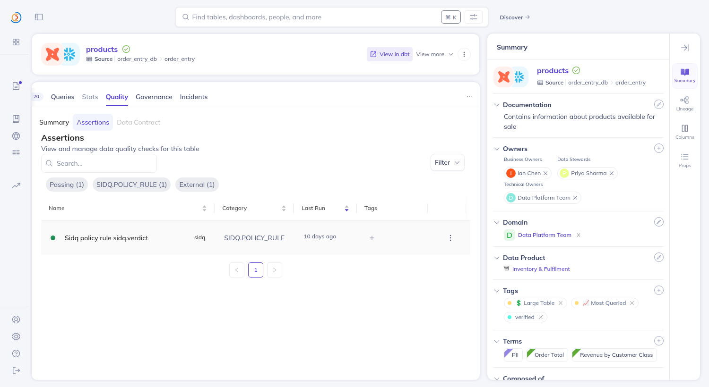

# Native assertion mirror

This is a live DataHub proof, run on 2026-08-09 against a DataHub OSS
quickstart with GMS v1.5.0.6. It shows that Sidq can mirror an
already-written receipt into DataHub's native Assertion surface, where the
verdict reaches the Validation/Quality tab — using DataHub's documented
GraphQL custom-assertion API (`upsertCustomAssertion` /
`reportAssertionResult`), from the same environment the judge runbook
installs, with zero dependencies beyond the Python standard library.

An earlier revision of this example wrote the same aspects through the
`acryl-datahub` SDK, which could not live in the project environment (its
`pydantic` pin contradicts the `mcp>=2` client every other Sidq command reads
through) and therefore needed a second interpreter. The GraphQL product API
removed that boundary entirely; the git history records both the boundary and
its fall.

The target dataset was
`urn:li:dataset:(urn:li:dataPlatform:dbt,b2fd91.order_entry_db.order_entry.products,PROD)`.
It already carried a live Sidq receipt with verdict `PASS`, commit
`faab25e9f5ef77f3df36c833b9f6048f21f3e933`, checked time
`2026-07-30T22:22:58Z`, policy hash
`baa612f729a56ff7497718cc3cf77cd9142967cb4ec0e075c2b3495eeb2f2927`, and
evidence document
`urn:li:document:shared-30fd40e4-a6cd-44e3-92bd-e74586c31ec1`.

That receipt recorded no per-rule evidence, so there was no rule-level result
to report. Rather than invent one, the mirror reported the whole verdict once
under its documented fallback rule id `sidq.verdict`, with the summary
`No individual rule evidence was recorded.` and `sidq.severity=verdict` to say
plainly which of the two levels this row is speaking for. A receipt that *does*
carry evidence produces one assertion per rule instead, each reported by that
rule's own severity.

The emitted assertion was
`urn:li:assertion:sidq-586a6093af5e6bc41c8708ce4199420b8d8f306578a07e88c6086636897cbadd`
— the deterministic URN Sidq derives from the dataset and rule id, which
`upsertCustomAssertion` accepts verbatim through its optional `urn` argument.
The first emission reported `created=1 existing=0 runs=1`; re-running the same
emission reported `created=0 existing=1 runs=1`. Two idempotency properties
stack here, both measured: the upsert replaces the same definition rather than
duplicating it, and DataHub derives the run id from `timestampMillis` and
deduplicates reports at the same timestamp — so a retried receipt updates its
event instead of accumulating copies.

## Reproducing it

Both steps target the same dataset, and both accept `SIDQ_EXAMPLE_URN` to
point at one of your own. The default URN carries this quickstart's instance
id (`b2fd91`) and will not exist in another catalog, so on your own DataHub
set that variable to a dataset that already holds a Sidq receipt.

```sh
export DATAHUB_GMS_URL=http://localhost:8080
export DATAHUB_GMS_TOKEN=...   # omit on an unauthenticated quickstart
.venv/bin/python examples/06-native-assertion/mirror_assertion.py
./examples/06-native-assertion/read_back.sh
```

`read_back.sh` issues the same GraphQL query DataHub's own UI issues. Compare
it with the response below **structurally, not byte-for-byte**: `nativeResults`
is a projection of an unordered map, so its member order varies between runs
even when every value matches.

## Captured GraphQL readback

The real response read from DataHub after emission, preserved verbatim:

```json
{
    "data": {
        "dataset": {
            "assertions": {
                "total": 1,
                "assertions": [
                    {
                        "urn": "urn:li:assertion:sidq-586a6093af5e6bc41c8708ce4199420b8d8f306578a07e88c6086636897cbadd",
                        "info": {
                            "type": "CUSTOM",
                            "description": "Sidq policy rule sidq.verdict",
                            "customAssertion": {
                                "type": "sidq.policy_rule",
                                "logic": "Sidq compared the dataset's collected catalog evidence with its policy and recorded the resulting verdict."
                            },
                            "source": {
                                "type": "EXTERNAL"
                            }
                        },
                        "runEvents": {
                            "total": 1,
                            "failed": 0,
                            "succeeded": 1,
                            "runEvents": [
                                {
                                    "status": "COMPLETE",
                                    "timestampMillis": 1785450178000,
                                    "result": {
                                        "type": "SUCCESS",
                                        "nativeResults": [
                                            {
                                                "key": "sidq.commit_sha",
                                                "value": "faab25e9f5ef77f3df36c833b9f6048f21f3e933"
                                            },
                                            {
                                                "key": "sidq.evidence_summary",
                                                "value": "No individual rule evidence was recorded."
                                            },
                                            {
                                                "key": "sidq.checked_at",
                                                "value": "2026-07-30T22:22:58Z"
                                            },
                                            {
                                                "key": "sidq.rule_id",
                                                "value": "sidq.verdict"
                                            },
                                            {
                                                "key": "sidq.policy_hash",
                                                "value": "baa612f729a56ff7497718cc3cf77cd9142967cb4ec0e075c2b3495eeb2f2927"
                                            },
                                            {
                                                "key": "sidq.severity",
                                                "value": "verdict"
                                            },
                                            {
                                                "key": "sidq.verdict",
                                                "value": "PASS"
                                            }
                                        ]
                                    }
                                }
                            ]
                        }
                    }
                ]
            }
        }
    },
    "extensions": {}
}
```

## The rendered tab

DataHub's own Quality tab for the same dataset, captured in a logged-in
browser session at 1500x820 on 2026-08-09. The filter row reads `Passing (1)`,
`SIDQ.POLICY_RULE (1)`, `External (1)`; the single row is the Sidq rule, and
its platform column reads **sidq**, because `upsertCustomAssertion` attributes
the assertion to the tool that made it — sitting beside the dataset's real
owners, tags and glossary terms rather than in a surface of Sidq's own.



## The whole CLI, from this environment

The full opt-in command — `sidq audit --via-mcp --budget 3 --write-receipts
--write-assertions` — was run end to end from the runbook venv on the same
day, twice, and the two transcripts prove two different properties.

With the audit's four per-rule assertions live in the catalog:

```text
  receipts written  2 of 2
  assertion runs    4 from 2 written receipts
  assertions        0 new, 4 updated, 0 retired, 0 left deleted
```

Receipts through the official MCP tools and four per-rule assertion updates
through the GraphQL API, in one process, each rule carrying its finding's own
`info` severity rather than the receipt verdict.

With the same four soft-deleted by the operator beforehand:

```text
  receipts written  2 of 2
  assertion runs    0 from 2 written receipts
  assertions        0 new, 0 updated, 0 retired, 4 left deleted
```

The mirror refused to resurrect any of them even though their rules fired
again: a deletion is a decision, and the run reports honoring it instead of
quietly reversing it.

## What this does not prove

It is one DataHub OSS quickstart at one version. Rendering is not claimed for
DataHub Cloud or other releases, and the screenshot is a picture of that
session rather than something a reader re-derives; the GraphQL response is the
reproducible part.

**Removing a Sidq assertion takes the soft-delete path, not `deleteAssertion`.**
Measured here: `deleteAssertion` refuses a CUSTOM assertion with `Unsupported
Assertion Type CUSTOM provided`, while `batchUpdateSoftDeleted` accepts it and
the assertion leaves the tab:

```graphql
mutation { batchUpdateSoftDeleted(input: {urns: ["urn:li:assertion:sidq-..."], deleted: true}) }
```

A soft-deleted assertion stays out — on the writing path as well as the
retirement path, as the `4 left deleted` run above shows live.
